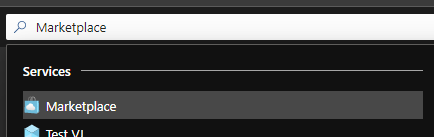
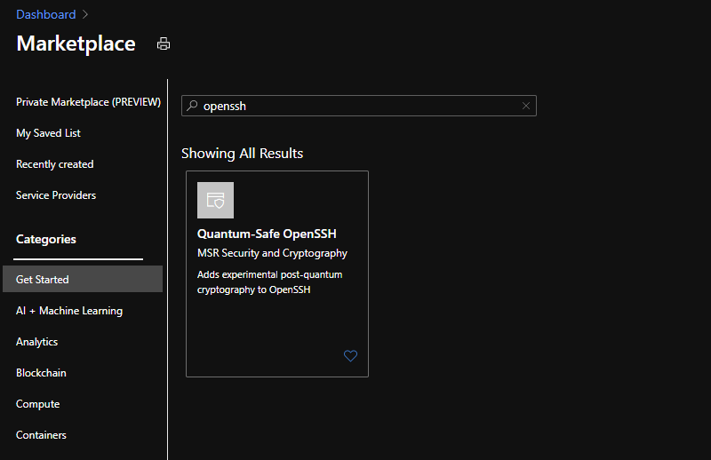
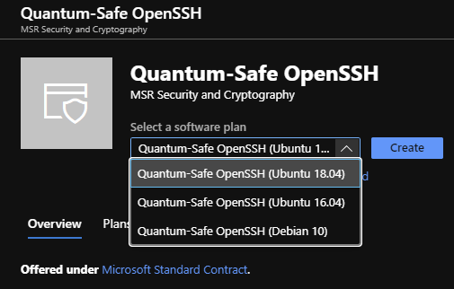
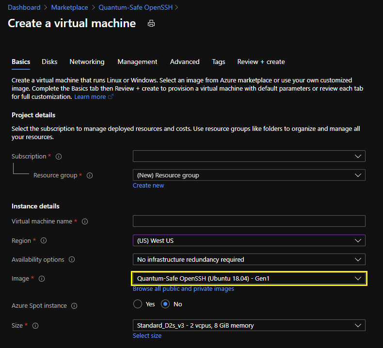
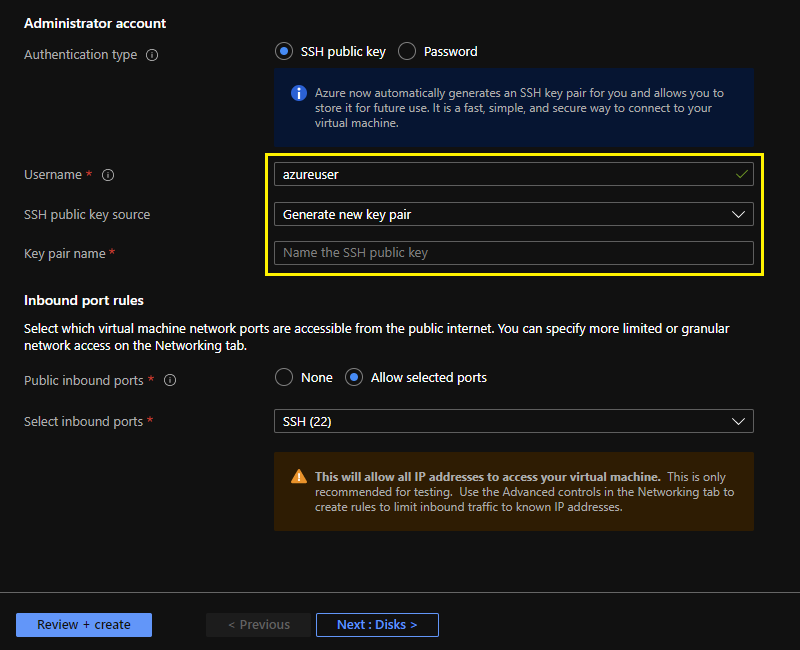

# Create a new Linux VM from the Azure Marketplace

Virtual machine images with quantum-safe OpenSSH are available though the Azure Marketplace and may be created through the Azure Portal UI. 

 

## Locate Marketplace Offer
Log into the Azure Portal and navigate to the Azure Marketplace.  

Typing __Marketplace__ from into the search box at the top of the Azure Portal will present a link to the Marketplace.  

  

Select __Marketplace__ from the __Services__ list to proceed to the Marketplace screen.

Type the word __openssh__ into the __Search the Marketplace__ box and press `[Enter]`. You should now see the __Quantum-Safe OpenSSH for Linux VM on Azure__ marketplace offer.  

Click on the __Quantum-Safe OpenSSH__ offer in the results pane to navigate to the offer page.

 
 

## Create the Virtual Machine  

Select the desired Linux distro from the __Select a plan__ menu.  

Click the  button to proceed to the __Create a virtual machine__ page.  

 

This is the standard virtual machine creation page with the __Image__ field pre-set to __Quantum-Safe OpenSSH__.  

Enter appropriate values for your desired virtual machine leaving the __Image__ field unchanged.  
See [Create a Windows virtual machine in the Azure portal](https://docs.microsoft.com/en-us/azure/virtual-machines/windows/quick-create-portal) documentation for additional information on this process.  

 

## Create Administrator Account
The __Administrator account__ may be created with a password or a public key.

__Using password__  
By default, the quantum-safe OpenSSH server installed on the Azure VM has password authentication disabled.  If you give the Administrator account a password here, it will enable password authentication on the OpenSSH server. It is recommended you use the SSH public key method below.

__Using public key__  
The Azure portal __SSH public key__ field supports only SSH-2 RSA public keys. You cannot provide a quantum-safe public key at this stage. You will need to provide a standard RSA key here to create the VM. You may then provision a quantum-safe public key after the VM is created. See [Create and use an SSH public-private key pair for Linux VMs in Azure](https://docs.microsoft.com/en-us/azure/virtual-machines/linux/mac-create-ssh-keys) for additional information on SSH key creation.   

>__Note:__  
>OpenSSH server is configured to listen on port 22. Leave port 22 enabled in the __Inbound port rules__ sections.  
You may change the OpenSSH port to another port after VM creation. Changing the port requires allowing your new inbound port in the VM network configuration.

 

## Create the VM
When all the required fields are populated, click the  button.  
If all the entries are valid, you will see a __Validation passed__ banner. 

Now click the  button to create the VM.  
This may take several minutes to complete.  

 

#
[Quantum-Safe OpenSSH for Linux VM on Azure (README)](../README.md#Quantum-Safe-OpenSSH-for-Linux-VM-on-Azure)  
[Create New Azure Virtual Machine \[Top\]](#)  
[SSH Client Setup](./Client.md)  
[Connect Client To Server](./Connect.md)  
[Source Code & Development](./Dev.md#source-code-/-development)
