# Source Code / Development

- [Install Visual Studio Code](#install-visual-studio-code)
    - [Install Remote Development Extensions](#install-remote-development-extensions)
- [Configure Public Keys](#configure-public-keys-for-remote-connection)
- [Connect Visual Studio Code to Your Remote VM](#connect-visual-studio-code-to-your-remote-vm)
    - [Open Project Folder](#open-the-project-folder)
    - [Install Recommended Extensions](#install-recommended-extensions)
- [Build](#build)
- [Run](#Run)
- [Debug](#debug)
    - [Project Defined Breakpoints](#project-defined-breakpoints)

<br>

The source code for the quantum-safe OpenSSH client and server packages is pre-installed on the Quantum-Safe OpenSSH for Linux VM on Azure marketplace images. The Azure Linux VMs do not have a graphical desktop installed. However, using Visual Studio Code you may connect from a remote client machine to explore, build, and debug the source code directly on the VM from your client machine.

<br>

## VM Prerequisites
The Azure VMs have the following packages pre-installed:

```
# Ubuntu 16.04 LTS
    build-essential devscripts cmake ninja-build zlib1g-dev dh-exec libaudit-dev libedit-dev libgtk-3-dev libkrb5-dev \
	libpam0g-dev libsystemd-dev libwrap0-dev libselinux1-dev gdb quilt doxygen python3-pytest graphviz astyle \
    dh-autoreconf=12~ubuntu16.04.1 debhelper=10.2.2ubuntu1~ubuntu16.04.1
    * also requires backports of gcc-7+, libssl1.1
```
```
# Ubuntu 18.04 LTS
    build-essential devscripts cmake ninja-build zlib1g-dev dh-exec libaudit-dev libedit-dev libgtk-3-dev libkrb5-dev \
	libssl-dev libpam0g-dev libsystemd-dev libwrap0-dev libselinux1-dev python3-pytest python3-pytest-xdist gdb doxygen \
	quilt graphviz astyle
```
```
# Debian 10
    build-essential devscripts cmake ninja-build zlib1g-dev dh-exec libaudit-dev libedit-dev libgtk-3-dev libkrb5-dev \
	libssl-dev libpam0g-dev libsystemd-dev libwrap0-dev libselinux1-dev quilt python3-pytest python3-pytest-xdist gdb \ 
	doxygen graphviz astyle
```

<br>

## Install Visual Studio Code

Install the free Visual Studio Code editor application on your local client machine:  
https://code.visualstudio.com/Download

<br>

## Install Remote Development Extensions

Visual Studio Code requires the __Remote Development__ extensions package to allow VS Code to browse, build, and debug source code on a remote machine.

Open __Visual Studio Code__ on your client Windows or Linux machine.

Click the __Extensions__ 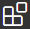 icon:  

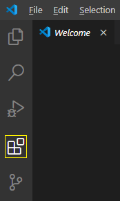

Type __remote development__ into the Marketplace search box to find the __Remote Development__ extension pack:

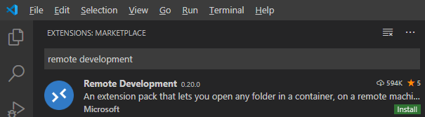

>__Note:__ the official extension name is _ms-vscode-remote.vscode-remote-extensionpack_ if you cannot find it in the Marketplace search.


Click the green install &nbsp;  &nbsp; button to install the extension.

The __Remote Development__ extension is actually a package of several extensions:  

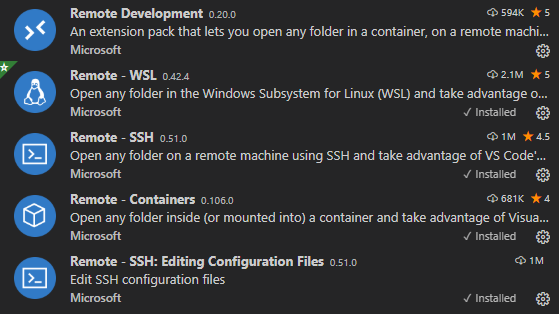

You will see these other extensions are now marked as installed  

The __Remote Explorer__ icon will now be available:


<br>

For more information on configuring Visual Studio Code for remote development see:  
https://code.visualstudio.com/docs/remote/ssh

<br>
<br>


## Configure Public Keys for Remote Connection

VS Code Remote Development connection uses a SSH connection to connect to the Azure Linux VM. Therefore you will require a public-private key pair to authenticate this connection.  You may use the same keys that you normally use to connect to your VM over SSH or create a new pair.


> __Note:__  
> On Windows, Visual Studio Code will use the standard Windows SSH client to connect to the remote Linux VM.  
> We do not currently provide a Windows SSH client that supports quantum-safe algorithms. The Visual Studio Code remote connection will be limited to standard SSH algorithms when using the Windows SSH client.

<br>

## Connect Visual Studio Code to Your Remote VM

This section assumes Visual Studio Code has been installed, configured for remote development, and your public key is in the server's authorized_keys file. See the steps to install VS Code and configure the Remote Development extensions above.

1. Open Visual Studio Code. If you have already configured a connection to a host, skip to step 5.

2. Press `F1` to open the Command Palette. Type __remote__ into the Command Palette to bring up the `Remote-SSH: Add New SSh Host...` option and select it.

    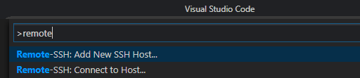

3. Enter `ssh <your-ssh-usernam>@<host-ip-address>` and press [Enter].

    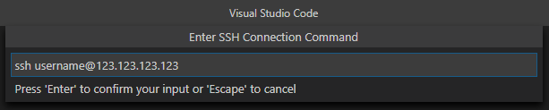

4. Click on the SSH configuration file. On Windows, the file will be `C:\Users\<your-user-name>\.ssh\config`. Your connection info for this host will be saved in this file for future connections.


    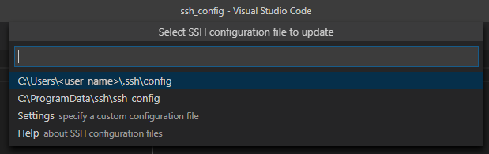

5. Click the __Remote Explorer__ icon  to open the Remote Explorer. Click the IP address of your new host then click the connect icon 

    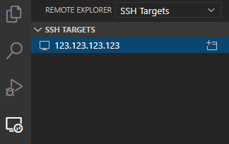

6. A new instance of Visual Studio Code will open with a prompt to select the platform of the host. You will only see this prompt the first time you connect. Click the appropriate platform for you host.

    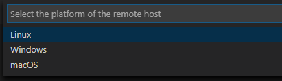

7. You will now be presented with a fingerprint of the host public key. Click __Continue__ to proceed. You will only see this prompt the first time you connect.

    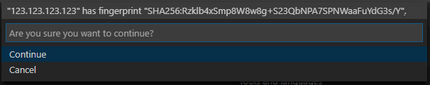

8. There will be a brief setup message in the lower right corner.

    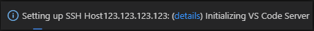

    You are now connected. 

<br>

## Open the Project Folder

1. Open the __File__ menu and select __Open Folder...__.

    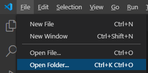

2. Select the __PQOpenSSH__ folder from the dropdown list and click the __OK__ button.

    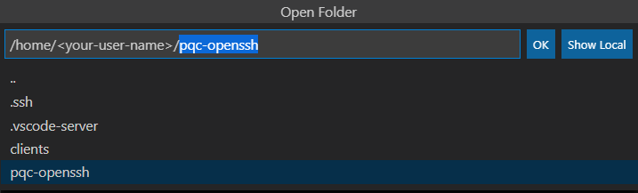

3. The project will now be loaded.

<br>

## Install Recommended Extensions

1. After loading the project folder, for the first time, you will be prompted to install the recommended extensions for this project. Click the __Install All__ button to install the __C++__ extension.  The C++ extension is required to add C/C++ language support to Visual Studio Code.

    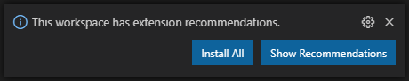


2. The project is now ready. Click the __Explorer__ icon  to browse the project source files.

    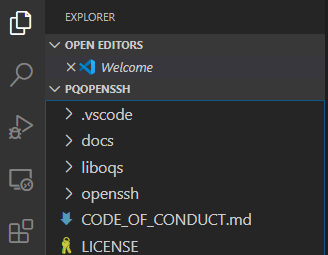

<br>

## Future Remote Connections

After your initial connection and configuration, connecting to your remote VM is much simpler.

1. Open Visual Studio Code on your local machine.

2. Click the __Remote Explorer__ icon  to open the Remote Explorer. Click the ip-address/hostname of your remote VM and then click the connect icon 

3. A new instance of VS Code will open connected to the remote machine. Open your project folder.

<br>

## Build

The Visual Studio Code project has four build __tasks__.

To start a build task, select the __Terminal__ menu then the __Run Build Task...__ menu item. Alternatively, you can use the __Ctrl+Shift+B__ keyboard shortcut.  

This will present a menu with the available build tasks:

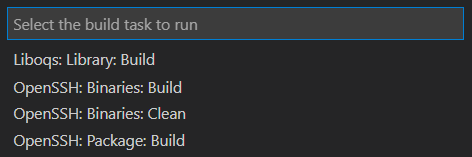

- __Liboqs: Library: Build__ :  
Builds the static liboqs library. 

- __OpenSSH: Binaries: Build__ :  
Builds the quantum-safe OpenSSH binaries into the `bin` folder.  
_Requires the liboqs library `./liboqs/lib/liboqs.a`_

- __OpenSSH: Binaries: Clean__ :  
Cleans the quantum-safe OpenSSH build tree.

- __OpenSSH: Package: Build__ :  
Builds the quantum-safe OpenSSH application packages into the `packages` folder.  
_Requires the liboqs library `./liboqs/lib/liboqs.a`._  
_This does not require __OpenSSH: Binaries: Build__ to be built first._


Select the desired build task. The build will start immediately and progress will be visible in the Terminal window. Building the OpenSSH source may take several minutes.

<br>

### Build Output


&nbsp;&nbsp;__liboqs library__  
    `./pqc-openssh/liboqs/lib/liboqs.a`

&nbsp;&nbsp;__OpenSSH server application__  
    `./pqc-openssh/bin/server/sshd`

&nbsp;&nbsp;__OpenSSH client applications__ (ssh client, ssh-keygen, etc.)  
    `./pqc-openssh/bin/client/*`

&nbsp;&nbsp;__OpenSSH installer packages__  
    `./packages/*`  


 <br>

>__Note:__  These packages are built with dependencies from the platform on which they were built. For example, building the packages on a Debian-10 platform will possibly result in errors if attempting to install the packages on an Ubuntu 16 platform.

>__Note:__  
The OpenSSH binaries are built with debug symbols enabled.  
The OpenSSH application packages strip the symbols.

<br>


## Run
This Visual Studio Code project has been configured to allow executing SSH client/server connections through VS Code 'Tasks'. __Server__ and __Client__ launch tasks allow you to start a SSH server instance using your recent build and connect to it from the SSH client.  

These launched __server (sshd)__ and __client (ssh)__ instances are running as standalone processes and are not replacing the OpenSSH-server and OpenSSh-client applications installed on the VM. To replace the VM's OpenSSH applications, build and install the packages created by the __OpenSSH: Package: Build__ build task.

<br>

### Create Keys

Although our client/server connection will occur on the same machine, the client's public key still needs to be in the __authorized_keys__ file for the server to allow the connection.  The project has a [__Task__ to generate quantum-safe keys](#run-generate-key-task) and place them in the __authorized_keys__ file.  

The server will already posses one host key of each type at `/etc/ssh/*`, so there is no need to generate server host keys.

>__Note:__  
>By default, the Azure Linux VM will not have any pre-populated host keys of the __qtesla__ or __rainbow__ type. The large size of the keys can cause SSH clients to fail to connect even when using keys of other types. To add the qtesla and/or rainbow host keys run `sudo ssh-keygen -t <key-name>` at the terminal.

<br>


### Run Generate Key Task

1. In the __Terminal__ menu, select __Run Task...__  
2. From the Tasks menu, select __Generate SSH Key Pair__
3. Select the client public key type from the drop-down list of public key algorithms.  
Selecting a key type will create a key-pair in VM's `/home/$USER/.ssh` folder and add the public key to the VM's `/home/$USER/.ssh/authorized_keys` file.
4. You will see the output of the key generation in the Terminal window. This key-pair is now ready to use. You may reuse these keys for future client/server connections and will not need to recreate the keys each time.
    >__Note:__ If you attempt to recreate an existing key-pair of the same type, you will get an error in the Terminal window. A new key-pair will not be created. Delete the existing key-pair from `/home/$USER/.ssh` before creating a new key-pair of that type.

<br>

### Launch Server

This will start a new SSH server instance running on the Azure VM listening on port 2222. This server uses the __sshd__ application from your most recent build.

1. Click the __Run__ icon  to open the __Run__ pane.

2. From the __Run__ dropdown, select __Sever (sshd): Launch Debug__ and click the __Run__ button 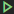.

3. If using a __Debug__ build, the __Debug Console__ will fill with symbol loading output:  

    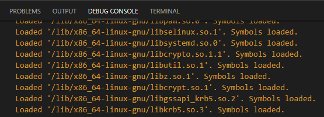

4. The __Terminal__ pane will show that the sshd server has been launched and is listening on port 2222.

    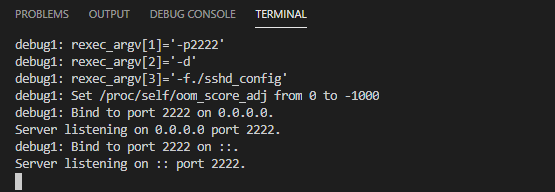

<br>

### Launch Client

This will start a new SSH client instance running on the Azure VM and will attempt to connect to the server started above on port 2222. This client uses the __ssh__ application from your most recent build.

1. Click the __Run__ icon  to open the __Run__ pane.

2. From the __Run__ dropdown, select __Client (ssh): Launch Debug__ and click the __Run__ button .

3. The SSH client will connect to our SSH server over port 2222 and produce debug output in the client terminal window. 

    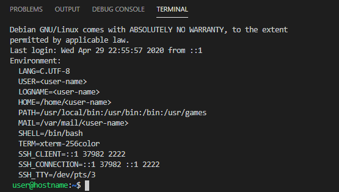

4. You are now connected over this new SSH connection. Type `exit` to close the connection and end the session. The `sshd` server will terminate once the connection is closed.

>__Note:__  
> You can switch between the client and server terminals using the terminal selector. `sshd` is the server, `ssh` is the client.  

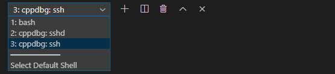

<br>

You will now have a quantum-safe client-to-server SSH connection. You may examine the debug output of the client and server terminals to see the details of the connection negotiation as well as the quantum-safe algorithms that were chosen. See the next section for information on selecting specific algorithms.

<br>

### Selecting SSH Algorithms

You may wish to select specific algorithms when establishing your quantum-safe SSH client-to-server connection. The VS Code project provides two methods to do this.

Each of these algorithm selection methods requires updating the client and/or server `args` list in the `./.vscode/launch.json` file. There is an `args` section for both the __client__ and __server__.  For each the client and server you may select __KexAlgorithms__, __HostKeyAlgorithms__, and/or __PubkeyAcceptedKeyTypes__ parameters.

See [Overriding Algorithms](Connect.md#overriding-algorithms) for additional information on these parameters.

```
# server args section:

"args": [
    "-p2222",           // The port that openssh-server (sshd) will listen on                
    "-d",               // This will run sshd in debug mode and do limited forking
    "-f./sshd_config",  // Comment this out to use the OS installed sshd sshd_config

    // -------------------------------------------------------------------------------
    // Algorithm selection options:
    //
    // There are three optional algorithm parameters for the SSH client and server:
    //
    //   -oKexAlgorithms 
    //        specify the allowed key-exchange/key-encapsulation algorithm(s)
    //
    //   -oHostKeyAlgorithms
    //        specify allowed server host-key algorithm(s)
    //
    //   -oPubkeyAcceptedKeyTypes 
    //        specify allowed client public-key algorithm(s)
    //
    // You may set these here. There are two ways to set the algorithms: hard-coded values or 
    // input-selector:
    //
    // Example: allow specific algorithm(s) by name
    // "-oKexAlgorithms=frodo-976-aes-sha384@openquantumsafe.org",
    // "-oHostKeyAlgorithms=ssh-rsa3072-picnic3l1,ssh-p256-dilithium2",
    // "-oPubkeyAcceptedKeyTypes=ssh-rsa3072-falcon512",
    //
    // Example: set the allowed algorithm(s) using the input-selector prompt at launch time:
    // "-oKexAlgorithms=${input:kexAlgorithm}",
    // "-oHostKeyAlgorithms=${input:hostKeyAlgorithm}",
    // "-oPubkeyAcceptedKeyTypes=${input:publicKeyAlgorithm}",
    //
    // -------------------------------------------------------------------------------

    //"-oKexAlgorithms=<algorithm(s)>",

    //"-oHostKeyAlgorithms=<algorithm(s)>",

    //"-oPubkeyAcceptedKeyTypes=<algorithm(s)>",

],
```
1. __Use the input selector__  

    This allows you select algorithms from a menu list at server/client launch time.  
  
    Set the algorithm parameters in the `args` section to the appropriate input-selector variables:

    ```
    "-oKexAlgorithms=${input:kexAlgorithm}@openquantumsafe.org",

    "-oHostKeyAlgorithms=${input:sigAlgorithm}",

    "-oPubkeyAcceptedKeyTypes=${input:sigAlgorithm}",
    ```

2. __Hard-code the algorithms__

    This allows you hard-code your desired algorithms for the server/client.  
  
    Set the algorithm parameters in the `args` section to the desired algorithm names:

    ```
    "-oKexAlgorithms=frodo-976-aes-sha384@openquantumsafe.org",

    "-oHostKeyAlgorithms=ssh-rsa3072-picnic3l1,ssh-p256-dilithium2",

    "-oPubkeyAcceptedKeyTypes=ssh-rsa3072-falcon512",
    ```


>__Note:__   
If you select a __PubkeyAcceptedKeyTypes__ algorithm for which you do not possess a key-pair of that type, you will get an __access denied__ error from the server during the client connection.
>To list algorithms of your available client keys, run this command in a terminal window:    
>`grep -oEh "^ssh-(\w|-)*" ~/.ssh/*.pub`

>__Note:__  
>You may use more than one of the algorithm selection methods together. For example, selecting more than one key-exchange algorithm is valid. The client/server will see it as a short list of algorithms and select one based on its internal prioritization algorithms.

<br>

## Debug

When creating binaries with the __OpenSSH: Binaries: Build__ task, you may set breakpoints in the source code. The project provides some predefined breakpoints through __gdb__ commands at points where quantum-safe algorithms are used.

>__Note:__ gdb command breakpoints are used because VS Code does not currently offer a way to pre-define breakpoints for a project. If you wish to set your own breakpoints, use the VS Code IDE method of setting breakpoints.

See [Visual Studio Code Debugging](https://code.visualstudio.com/docs/editor/debugging) for additional information on debugging with Visual Studio Code.

### Project Defined Breakpoints

The project defined breakpoints are enabled by <i>un</i>commenting sections of the `setupCommands` section of the `./.vscode/launch.json` file.

You may set your own additional breakpoints in the source code using the Visual Studio Code IDE.

#### Server Breakpoints

The SSH server (sshd) will _fork_ when a connection is attempted. OpenSSH server will create a copy of itself to handle the client connection. Therefore, client-connection handling code will execute in a different process than the listening server process.

The __gdb__ debugger can either debug the parent process or the child (forked) process. Which process it debugs is determined by setting the _fork-follow-mode_ property to either _parent_ or _child_ in the setup command section of `./.vscode/launch.json`

Uncomment either the __child__ or __parent__ _fork-follow-mode_ line to set the mode. 
```
"setupCommands": [
    {
        "description": "Follow child fork",
        
        // set follow-fork-mode to child or parent. comment out one or the other lines below:

        "text": "-interpreter-exec console \"set follow-fork-mode child\"",
        //"text": "-interpreter-exec console \"set follow-fork-mode parent\"", 

        "ignoreFailures": true
    },
```

Uncomment these setup command sections in `./.vscode/launch.json` to enable these predefined gdb breakpoints:

- Server calls key-encapsulation function

    ```
        {   // Requires follow-fork-mode = child
            "description": "Break on Key Encapsulation (KEM)",
            "text": "-interpreter-exec console \"break OQS_KEM_encaps\"",
            "ignoreFailures": true
        },
    ```

- Server verifies signature

    ```
        {   // Requires follow-fork-mode = parent
            "description": "Break on PQ Authorization Signature Verification",
            "text": "-interpreter-exec console \"break OQS_SIG_verify\"",
            "ignoreFailures": true
        },
    ```

- Server selects key-exchange/encapsulation algorithm
    ```
        {   // Requires follow-fork-mode = child
            "description": "Break on server PQ KEX Selection",
            "text": "-interpreter-exec console \"break choose_kex\"",
            "ignoreFailures": true
        },
    ```

- Server selects host key algorithm
    ```
        {   // Requires follow-fork-mode = child
            "description": "Break on server PQ HostKey Selection",
            "text": "-interpreter-exec console \"break choose_hostkeyalg\"",
            "ignoreFailures": true
        },
    ```
- Server loads defaults from config 
    ```
        {
            "description": "Break on server loading default options",
            "text": "-interpreter-exec console \"break fill_default_server_options\"",
            "ignoreFailures": true
        },
    ```


#### Client Breakpoints

The client does not use forking like the server, so it is not required to set the _fork-follow-mode_ for client breakpoints.

- Client key de-encapsulation function
    ```
        {
            "description": "Break on Key De-capsulation",
            "text": "-interpreter-exec console \"break OQS_KEM_decaps\"",
            "ignoreFailures": true
        },
    ```

- Client generates signature
    ```
        {
            "description": "Break on PQ Authorization Signature creation",
            "text": "-interpreter-exec console \"break OQS_SIG_sign\"",
            "ignoreFailures": true
        },
    ```

- Client selects key-exchange/encapsulation algorithm 
    ```
        {
            "description": "Break on server PQ KEX Selection",
            "text": "-interpreter-exec console \"break choose_kex\"",
            "ignoreFailures": true
        },
    ```

- Client selects host key algorithm
    ```
        {
            "description": "Break on server PQ HostKey Selection",
            "text": "-interpreter-exec console \"break choose_hostkeyalg\"",
            "ignoreFailures": true
        },
    ```
>__Note:__  
>Breakpoints set with the above __gdb__ commands may display __Exception has occurred.__ in the VS Code IDE. These messages can be disregarded as VS Code interprets the gdb breakpoints as exceptions.

<br>

#  
[Quantum-Safe OpenSSH for Linux VM on Azure (README)](../README.md#Quantum-Safe-OpenSSH-for-Linux-VM-on-Azure)  
[Create New Azure Virtual Machine](./CreateVM.md)  
[SSH Client Setup](./Client.md)  
[Connect Client To Server](./Connect.md)  
[Source Code & Development \[Top\]](#)
